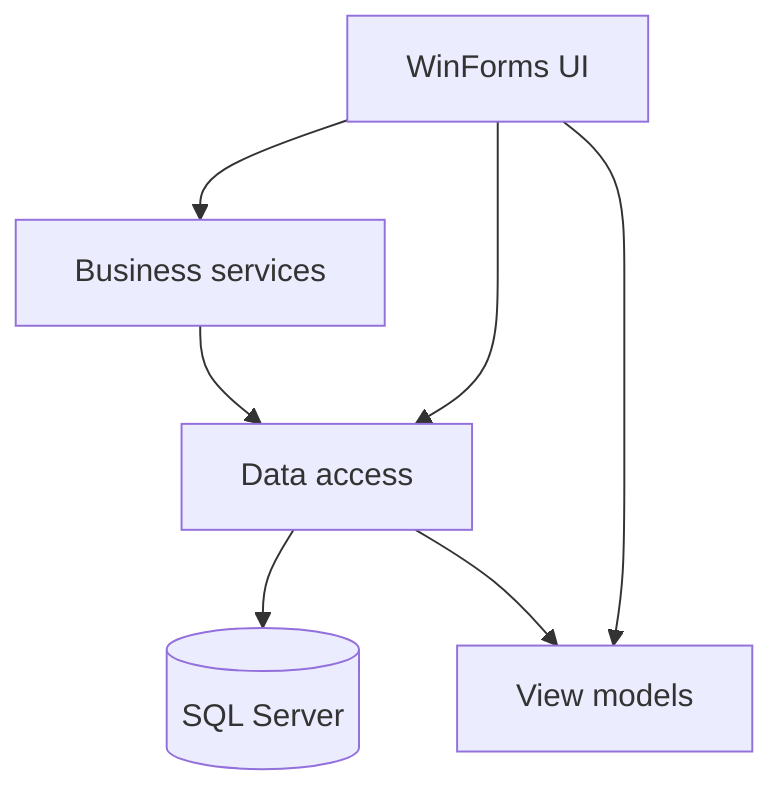

# Accounting Manager for Windows

[](https://github.com/AmirhosseinZangeneh/AccountingManager-WinForms/actions/workflows/build.yml)


A layered Windows desktop application for managing customers, recording receipts and payments, and reviewing financial activity.

The repository preserves an early WinForms project while applying targeted architecture, security, reliability, and UI improvements so it can be built, understood, and evaluated independently.

## Highlights

- Modernized dashboard with responsive financial summary cards and quick actions
- Consistent, code-generated icon system with no third-party visual dependency
- Customer management with contact details and profile images
- Receipt and payment entry with validation
- Date- and customer-based transaction reports
- Multi-page native print preview
- Salted PBKDF2 password hashing with legacy credential migration
- Windows-based continuous integration with GitHub Actions

## User Interface

The UI uses a restrained blue, slate, green, and red palette with Segoe UI typography and consistent spacing. Data grids use full-row selection, alternating backgrounds, clear headers, and responsive sizing.

The original decorative calculator illustration and mismatched image assets have been removed from the visible dashboard. Navigation now uses functional summary cards and a unified set of anti-aliased line icons generated by `IconFactory`.

Visual styling is centralized in:

```text
AccountingManager.App/UI/AppTheme.cs
AccountingManager.App/UI/IconFactory.cs
```

## Technology

| Area | Technology |
| --- | --- |
| Desktop UI | C#, Windows Forms |
| Runtime | .NET Framework 4.8 |
| Data access | Entity Framework 6.5.1, Database First |
| Database | SQL Server |
| Patterns | Repository, Unit of Work, service layer |
| Automation | GitHub Actions, MSBuild |

## Architecture



| Project | Responsibility |
| --- | --- |
| `AccountingManager.App` | Forms, navigation, validation, theming, logging, and printing |
| `AccountingManager.Business` | Authentication and dashboard business rules |
| `AccountingManager.DataLayer` | Entity Framework model, repositories, and unit of work |
| `AccountingManager.ViewModels` | Models used to transfer display data |
| `AccountingManager.Utilities` | Legacy reusable WinForms helpers |

## Getting Started

### Prerequisites

- Windows 10 or later
- Visual Studio 2022 with the **.NET desktop development** workload
- .NET Framework 4.8 targeting pack
- SQL Server Express, Developer edition, or LocalDB

### Database setup

1. Open SQL Server Management Studio.
2. Run `Database/AccountingManagerDb.sql`.
3. Confirm that the `AccountingManagerDb` database was created.
4. If your SQL Server instance is not the local default instance, update the `AccountingManagerDbEntities` connection string in `AccountingManager.App/App.config`.

The default connection uses Windows authentication and does not contain a database password.

### Run the application

1. Open `AccountingManager.sln` in Visual Studio.
2. Restore NuGet packages.
3. Set `AccountingManager.App` as the startup project.
4. Select **Build > Rebuild Solution**.
5. Run the application.

Local demo credentials:

```text
Username: admin
Password: ChangeMe123!
```

Change the credentials after the first sign-in. The demo account is intended only for a local development database.

## Project Structure

```text
AccountingManager/
├── AccountingManager.App/          WinForms UI and application infrastructure
├── AccountingManager.Business/     Business and authentication services
├── AccountingManager.DataLayer/    EF6 model and repositories
├── AccountingManager.ViewModels/   UI-facing view models
├── AccountingManager.Utilities/    Legacy shared utilities
├── Database/                       Repeatable SQL setup script
└── .github/                        CI and dependency automation
```

## Engineering Improvements

- Replaced machine-specific DLL references with restorable NuGet dependencies
- Upgraded the projects to .NET Framework 4.8
- Removed the proprietary reporting runtime and missing report-template dependency
- Added a shared design system and modern dashboard navigation
- Replaced inconsistent bitmap toolbar icons with code-generated line icons
- Corrected current-month and report date filtering
- Removed ambiguous customer lookup by display name
- Blocked deletion of customers with related financial transactions
- Added centralized user-facing error handling and local diagnostic logging
- Replaced transaction-type magic numbers with a named enum
- Added repeatable database setup and Windows CI

Application logs are written to:

```text
%LocalAppData%\AccountingManager\Logs\application.log
```

## Scope

This is a Windows-only, single-user educational desktop application. It demonstrates progression from CRUD-oriented WinForms development toward layered application design. It is not intended to be a production accounting, tax, auditing, or regulatory-compliance system.

## Author

**Amirhossein Zangeneh**  
[GitHub profile](https://github.com/AmirhosseinZangeneh)